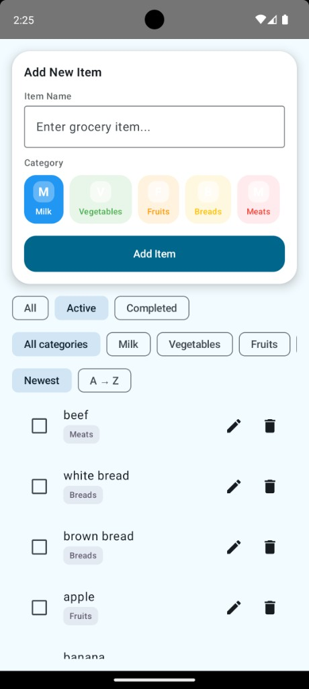
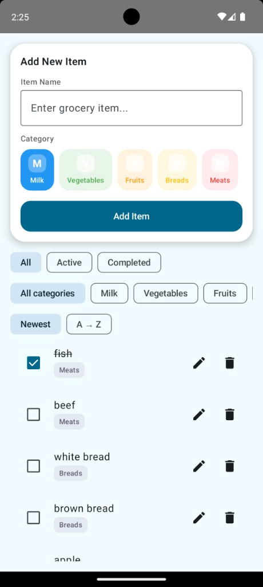
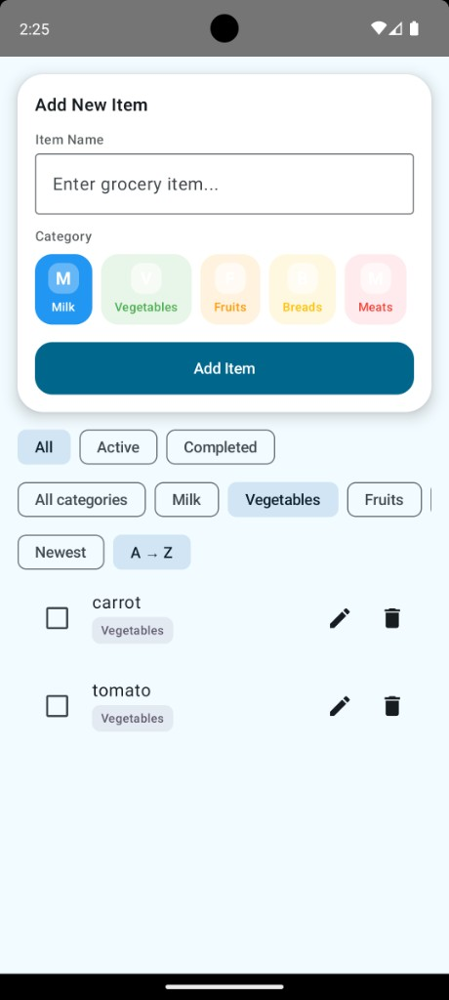
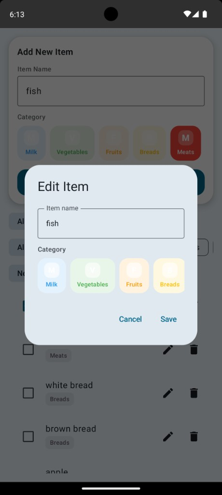

## Grocery List Android App

This project is a simple grocery list Android app built with **Kotlin**, **Jetpack Compose**, **Room**, **Hilt**, **Kotlin Coroutines + Flow**, and **Clean Architecture (domain / data / presentation)**.

### Screenshots

| Main screen | List with items | Filters & sort | Edit item |
|-------------|-----------------|----------------|-----------|
| Add new item card, category chips, status/category/sort filters | Grocery list with checkboxes, category tags, edit & delete | Category filter (e.g. Vegetables) and A→Z sort applied | Edit Item dialog: change name and category, Cancel/Save |

  
  
  
  

### Features

- **Add items** with a name and category (Milk, Vegetables, Fruits, Breads, Meats).
- **Visual category chips** and colorful badges for each category.
- **Mark items as completed**, edit existing items, and delete items.
- **Filters and sorting**:
  - Filter by **status** (All / Active / Completed).
  - Filter by **category**.
  - Sort by **Newest** or **Alphabetical (A→Z)**.
- **Empty state** screen that matches the provided design text:
  - “Your grocery list is empty — Add items above to get started”.
- **Persistence** using **Room** with fields:
  - `id`, `name`, `category`, `isCompleted`, `createdAt`.
- **MVVM + Use-cases** with unit tests for domain and ViewModel.

### Project Structure

- **Domain layer** (`domain/`)
  - `model/` — `GroceryItem`, `GroceryCategory`, `AddItemResult`.
  - `repository/` — `GroceryRepository` interface.
  - `usecase/` — One use-case per file:
    - `GetGroceryItemsUseCase`
    - `AddGroceryItemUseCase`
    - `UpdateGroceryItemUseCase`
    - `DeleteGroceryItemUseCase`
    - `ToggleCompletedUseCase`
- **Data layer** (`data/`)
  - `local/` — Room `GroceryItemEntity`, `GroceryDao`, `GroceryDatabase`.
  - `repository/` — `GroceryRepositoryImpl` that maps Room entities to domain models and implements `GroceryRepository`.
- **Presentation layer** (`presentation/`)
  - `MainActivity` — entry activity hosting the Compose UI.
  - `viewmodel/` — `GroceryListViewModel` (MVVM) exposing `GroceryUiState`.
  - `viewstate/` & `model/` — UI models (`GroceryItemUi`, `StatusFilter`, `SortOption`, `GroceryUiState`).
  - `GroceryScreen` — top-level screen wiring state and callbacks.
  - `components/` — split composables:
    - `AddItemCard` (with `CategoryChip`)
    - `FiltersRow`
    - `GroceryListItem`
    - `EmptyState`
    - `EditItemDialog`
- **DI** (`di/`)
  - `AppModule` — Hilt module providing Room database, DAO, and `GroceryRepository` implementation.

### Requirements

- **Android Studio** Ladybug or newer.
- **Minimum SDK** 26.
- **Compile/Target SDK** 35.

### Running the App

1. Open this folder in **Android Studio**.
2. Let Gradle sync finish (it uses **Version Catalog** via `gradle/libs.versions.toml`).
3. Select the `app` configuration.
4. Run on an emulator or device with **API 26+**.

### Tests

- **Domain use-case tests** (all use **MockK** for `GroceryRepository`)
  - `GetGroceryItemsUseCaseTest`
  - `AddGroceryItemUseCaseTest`
  - `UpdateGroceryItemUseCaseTest`
  - `DeleteGroceryItemUseCaseTest`
  - `ToggleCompletedUseCaseTest`
  - Cover fetching, validation (empty vs trimmed names), update/delete behavior, completion toggling, and repository error paths.
- **ViewModel tests** (use **MockK** + **Turbine**)
  - `GroceryListViewModelTest`
  - Cover:
    - Add flow (input cleared, success/validation-error snackbars).
    - Status and category filtering.
    - Sorting (Newest vs Alphabetical A→Z).
    - Edit dialog behavior and update success path.
    - Toggling completed items and delegating to the correct use-cases.

Run unit tests from Android Studio:

- Open the **`test`** directory under `app`.
- Right-click the `test` package and select **Run 'Tests in ...'**.

### Notes

- The UI is implemented entirely with **Jetpack Compose** and uses the refactored component structure (`components/`) for better reuse and readability.
- Data is backed by Room and exposed to the UI as `Flow` → `StateFlow` via the ViewModel for reactive updates.

